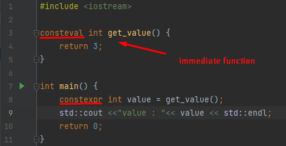
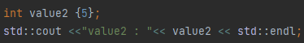
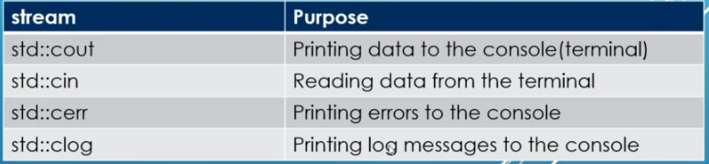
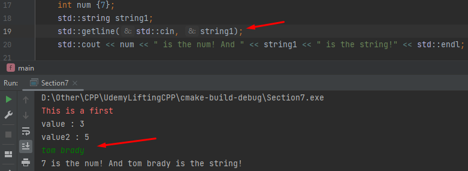
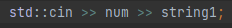

<h1>Section 7 Lessons</h1>
Cin and cout are the streams. The less than signs point to cout because that is where the string is going.
In the same manner cin points to variables because that is where the terminal input is going. 
-<b>std:string datatype</b>: This datatype specifically works with the std cout,cin,cerr,clog & getline functions 
-<b>"consteval" keyword</b>: A descriptor of a function. Makes that function an <i>immediate function</i> 
-<b>"constexpr" keyword</b>: ? 
-<b>Immediate function</b>: A function which is run at compile time to produce a constant before run-time 

    

-<b>Bracket initialize</b>: Variables can be initialized with brackets 

    

-<b>Standard streams</b>: These streams exist to prompt the terminal about the program in 4 different categories 

    

-<b>std::getline</b>: Reads a line and skips whitespace 

    

-<b>cin takes multiple</b>: Cin can take in multiple inputs 

    

