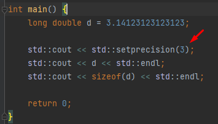
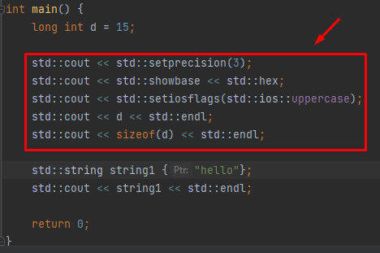
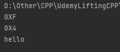
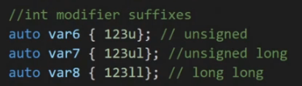

<h1>Section 8 Lessons</h1>
-<b>Send settings to cout</b>: You can send settings to cout

    
    
    

-<b>"auto" keyword</b>: automatically creates the primitive type of the variable according
to the initialized value. 
-<b>0xabcdefgh</b>: All numbers which start with <b>0x</b> are hexadecimal 
-<b>012345678912</b>: All numbers which start with <b>0</b> are from the octal system. 
-<b>ob00001111</b>: All numbers which start with <b>0b</b> are binary numbers. 
-<b>"singed/unsigned" keyword</b>: signed means having both positive and negative. Unsigned means only positive numbers.
An signed int is the same as int as the primitive is already signed. 
-<b>"long" keyword</b>: long conserves 4 bytes for an integer, "long" or "long int" are the same and so are
"long long" and "long long int" 
-<b>"short" keyword</b>: short conserved 2 bytes for an integer, "short" or "short int" are the same. 
-<b>"long double"</b>: A double floating point type which is 12 bytes, longer/more precise than a regular double. 
-<b>number suffixes</b>: Here are some suffixes you didn't know... 

     

