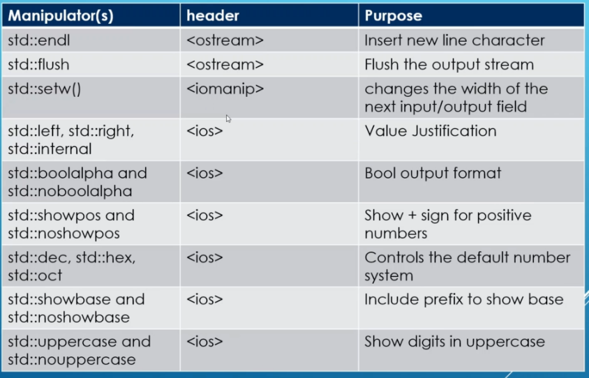
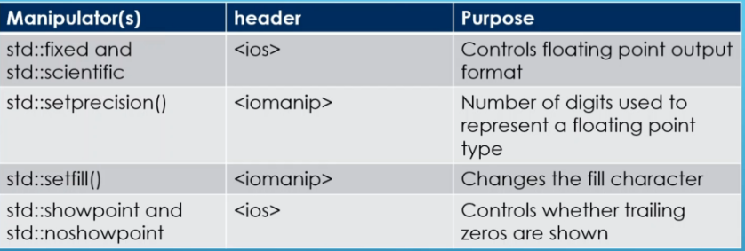
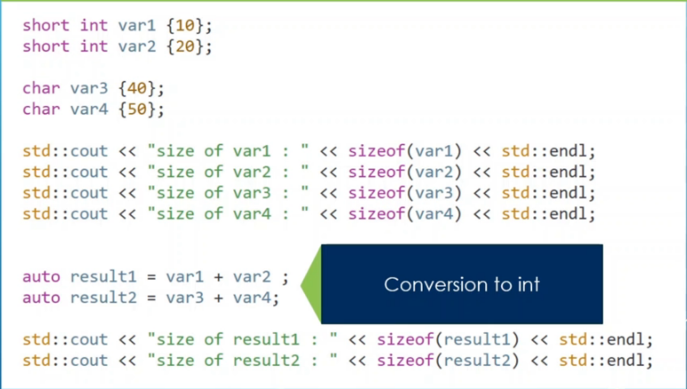

<h1>Section 9 Questions</h1>
What are some unique operations which you didn't know?

Does prefixing/postfixing look useful?
Its just simple adding and substracting with increment/decrement operator...

What are some output formatting tips? That looks kinda useful.
Use the main.cpp to find examples of std formatting. There is no way to memorize these,
You should find these as you go in your programming. Just note you can format
tables in C++ using formatting, along with some number manipulations. Think
of this as its own form of formatting, similar to Java using functions.
Instead of applying functions to Java, we apply properties to the stream,
which is probably a struct with magic.
And how did we find the functions of java? With autocomplete and reading
the documentation, which is what needs to be done here. Just use "std::" with one of the libraries 
importing std and you still see potential standard functions with autocomplete. Then read the docs.
Below is a table of the formatting functions used in 
formattingExamples.cpp

    
    

What are the math functions?
-cmath is the typical math.h from c. Just some math operators added to standard std::

What about math functions?
They are added to std::

What could possibly be some weird integral types?
Any interger type that is less than 4 bytes does not have operator overloading added to their
assembly primitives. So the compiler implicitly converts the data types to integer when
placing operators on them.

    

https://github.com/rutura/The-C-20-Masterclass-Source-Code/blob/main/5.OperationsOnData/5.11.WeirdIntegralTypes/main.cpp

What are some compound assignment operators?
=+, -=, etc...

<h1>Section 9 Lessons</h1>
-Base in iomanip is the 0b, 0x,0 in the other number systems formats in C++
-ostream, iomanip & ios contain stream manipulators for io
-limits library is about lowest, min, max. Min is closest to positive 0. Lowest and max are the most negative and positive numbers.
